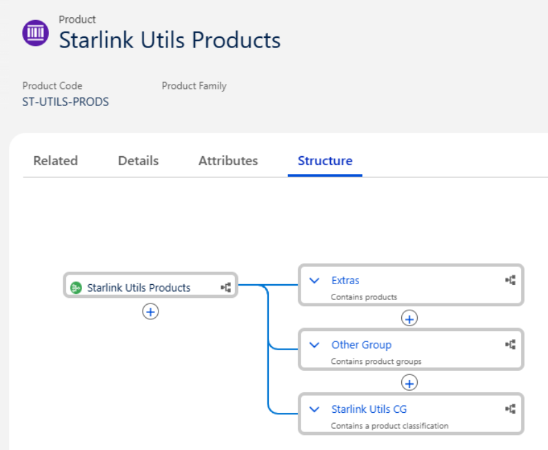
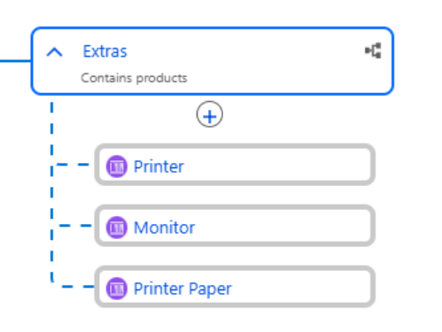
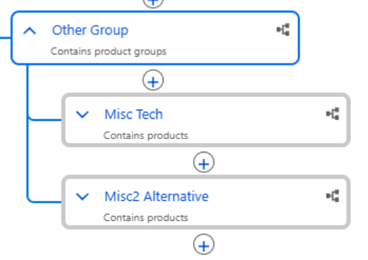
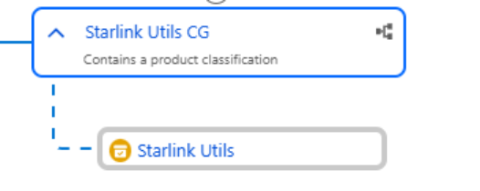
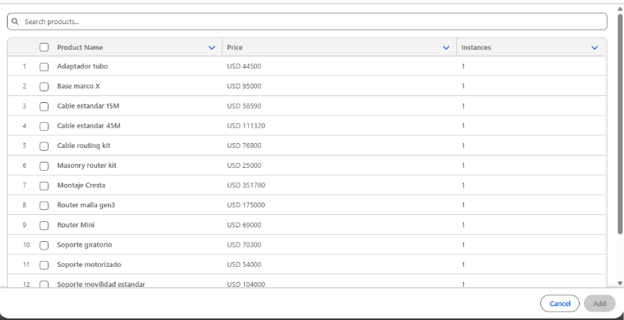
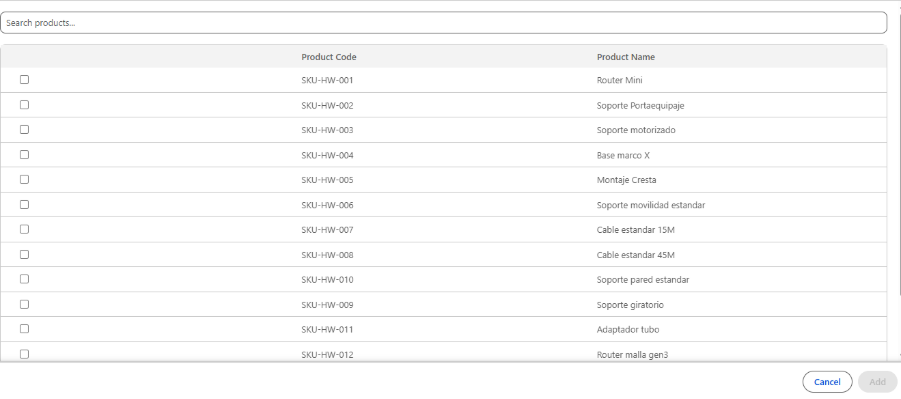
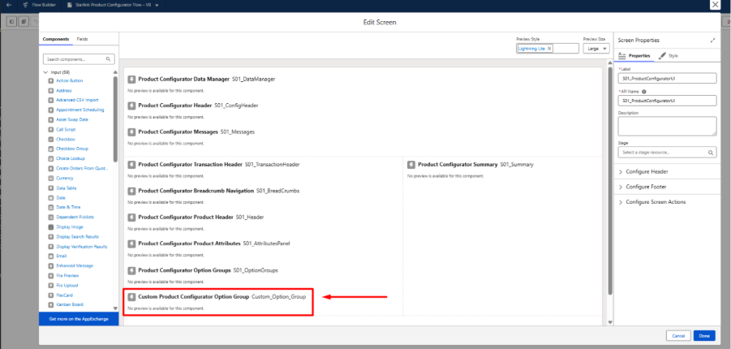

# 🚀 Beyond the Default: Extending the Agentforce Revenue Management Product Configurator with Custom LWC and Business APIs

*Agentforce Revenue Management • Product Configurator • LWC • Business APIs • Third-Party Configurator*

Agentforce Revenue Management (ARM) — *formerly Revenue Cloud Advanced, formerly Revenue Lifecycle Management* — ships with a solid out-of-the-box product configurator. For most scenarios, the default Screen Flow template does the job. But the moment your business requirements diverge from what Salesforce baked in, you hit a hard wall: the default UI is not configurable from the interface.

This post walks through a concrete scenario where the default configurator falls short, explains the architectural decision to replace it using the **Third-Party Configurator** pattern, and dives hands-on into the **Product Configurator Business APIs** — the headless layer that makes all of it possible. You'll see real PoC code, understand add/delete node flows, and walk away with a reusable utility class you can drop into your own projects.

---

## 🛑 The Problem: Default Configurator, Fixed Columns

Consider a product bundle called **"Starlink Utils Products"** (product code: `ST-UTILS-PRODS`). Its structure mixes three types of component groups:

- 📦 **Extras** — a simple group. Contains products (e.g., Printer, Monitor, Printer Paper).
- 🗂️ **Other Group** — a container group. Contains product groups with nested subgroups (Misc Tech, Misc2 Alternative).
- 🏷️ **Starlink Utils CG** — a classification group. Contains a product classification (a dynamic set of products driven by a product classification record).






The **classification group** is where the default configurator starts to show its limits. When a user opens the configurator and navigates to a classification group, Salesforce renders a modal-style picker showing available products.

### 📉 Limitations of the Default UI:
- A search box that filters **only by product name**.
- **Fixed columns**: Product Name, Price, and Instances — *not configurable from the UI*.
- **No way to expose additional fields** like Product Code, custom attributes, or SKU identifiers.



The business requirement: sales reps need to search by both **product name** and **product code (SKU)**, and the table should display **Product Code** alongside **Product Name** — dropping the Price and Instances columns that don't add value in this context.



> [!WARNING]
> **Why you can't just configure this away**
> 
> The standard Product Configurator Flow screen is a sealed Salesforce-managed template. You can clone it and modify layout at the Screen Flow level, but the inner LWC components for option group rendering are fixed black boxes. **There is no property to change which columns appear in the classification picker.** Customization at this level requires replacing the component entirely.

---

## 🏗️ The Solution Architecture

ARM offers two complementary extensibility mechanisms for the configurator layer:

1. **Custom Product Configurator Flow (Screen Flow)** — replace or extend the default Screen Flow with a custom one using standard ARM flow components plus your own custom LWC screens.
2. **Product Configurator Business APIs** — a set of headless Connect REST APIs that act as a stateful process orchestrator for the configuration session: loading state, mutating the configuration tree (add/update/delete nodes), and saving the final result.

In this scenario, the chosen approach is to create a **Custom Product Configurator Flow** that replaces *only* the option group screen component — keeping all other standard components (Data Manager, Header, Attributes Panel, Transaction Header, Summary, Footer) intact, and injecting a single custom LWC FlowScreen: `customProdConfigOptionGroup`.


This custom component talks directly to the Product Configurator Business APIs for all state mutations — it never writes directly to Salesforce objects. The configuration session is managed server-side through the API's instance state machine.

### 📊 Architecture at a glance

| Layer | Component | Responsibility |
|-------|-----------|----------------|
| 🌊 **Flow** | Custom Screen Flow (cloned) | Hosts standard ARM components + custom LWC |
| 🖥️ **UI** | `customProdConfigOptionGroup` | Renders groups/tabs/accordion, fires API calls |
| 🖥️ **UI** | `customPcogItem` | Single option row: checkbox, qty, pricing, configure |
| 🖥️ **UI** | `customPcogModal` | Classification picker with search + multi-select |
| 🔌 **API** | Product Configurator Business APIs | Stateful orchestrator: load, add, delete, save |
| 🛠️ **Utils**| `utils.js` | Reusable wire service wrapper and payload builders |

---

## ⚙️ Step 1 — Setting Up the Custom Product Configurator Flow

Before writing a single line of LWC code, there are three setup steps that must be completed in the org.

### 1.1 Clone the Default Flow
1. Open the App Launcher and navigate to **Flows**.
2. Find the default **"Product Configurator"** screen flow (the Salesforce-managed template).
3. Click **"Save As"** to create a copy you own — this is the one you'll customize.
4. In your cloned flow, open the main screen element (`S01_ProductConfiguratorUI`).
5. Remove the default **"Product Configurator Option Groups"** (`S01_OptionGroups`) component.
6. Drag your custom LWC component (`CustomProdConfigOptionGroup`) into the screen and wire the required flow variables.



### 1.2 Create a Product Configuration Flow Record
A Product Configuration Flow record is the bridge between a flow template and the products it applies to.

7. From the App Launcher, open **Product Configuration Flows**.
8. Click **New** and enter the Flow API Name of your cloned flow.
9. Set `Active = true`. Leave "Default" unchecked unless you want it applied org-wide.
10. **Save** the record.

### 1.3 Assign the Flow to a Product or Product Classification
11. Open the **Product Configuration Flow Assignment** tab.
12. Assign it to the specific product (e.g., "Starlink Utils Products") or to a product classification to apply broadly.
13. **Save**. The next time a sales rep clicks *Configure* on that product, your custom flow fires.

---

## 🔌 Step 2 — The Product Configurator Business APIs

The Business APIs are the backbone of any custom configurator implementation. They operate on a concept called a **configurator instance** — a server-side, session-scoped state machine representing the in-progress configuration. Think of it as a shopping cart that knows about structure rules, cardinality, pricing, and configuration logic.

### 📡 Full API surface

| Method | Resource | What it does |
|:---:|---|---|
| `POST` | `/configure (POST /connect/cpq/configurator/actions/configure)` | Retrieve and update a product’s configuration from a configurator. Execute configuration rules and notify users of any violations for changes to product bundle, attributes, or product quantity within a bundle. Additionally, get pricing details for the configured bundle. |
| `POST` | `/loadInstance (POST /connect/cpq/configurator/actions/load-instance)` | Create a session for the product configuration instance using the transaction ID. Get the session ID that includes the results of actions, such as configuration rules, qualification rules, and pricing management. |
| `POST` | `/getInstance (GET /connect/cpq/configurator/actions/get-instance)` | Fetch the JSON representation of a product configuration. Use the response to display the details of the product configuration instance on the Salesforce user interface, or save the product configuration instance to an external system.|
| `POST` | `/setInstance (POST /connect/cpq/configurator/actions/set-instance)` | Set a product configuration instance. This API is used in scenarios where the configuration instance is available in a different database than Salesforce and the product catalog management data is in Salesforce. |
| `POST` | `/saveInstance (POST /connect/cpq/configurator/actions/save-instance)` | Save a configuration instance after a successful product configuration. |
| `POST` | `/setProductQuantity (POST /connect/cpq/configurator/actions/set-product-quantity)` | Set the quantity of a product through the runtime system. |
| `POST` | `/addNodes (POST /connect/cpq/configurator/actions/add-nodes)` | Add a node to the context through the runtime system without using the Salesforce user interface. |
| `POST` | `/updateNodes (POST /connect/cpq/configurator/actions/update-nodes)` | Update nodes in a product configuration. |
| `DELETE` | `/deleteNodes (DELETE /connect/cpq/configurator/actions/delete-nodes)` | Delete nodes from a product configuration. |

For this PoC, the two most important operations are `addNodes` (user selects a product from the classification picker) and `deleteNodes` (user unchecks a product). Let's look at both in detail.

### ➕ `addNodes` — Adding a product to the configuration

When a user checks a product in the classification modal and clicks Add, the component calls `addNodes`. The payload structure looks like this:

```json
// POST /connect/cpq/configurator/actions/add-nodes
{
  "configuratorOptions": {
    "executePricing": true,
    "returnProductCatalogData": true,
    "qualifyAllProductsInTransaction": true,
    "validateProductCatalog": true,
    "validateAmendRenewCancel": true,
    "executeConfigurationRules": true,
    "addDefaultConfiguration": true
  },
  "qualificationContext": {
    "accountId": "001xx0000000001AAA",
    "contactId": "003xx00000000D7AAI"
  },
  "contextId": "008d27d7-e004-4906-a949-ee7d7c323c77",
  "addedNodes": [
    {
      "path": [
        "0Q0xx0000004EvcCAE",
        "ref_d3a3f8d2_e031_4517_ae28_69ce16cb6589"
      ],
      "addedObject": {
        "id": "ref_d3a3f8d2_e031_4517_ae28_69ce16cb6589",
        "SalesTransactionItemSource": "ref_d3a3f8d2_e031_4517_ae28_69ce16cb6589",
        "SalesTransactionItemParent": "0Q0xx0000004EvcCAE",
        "PricebookEntry": "01uxx00000090VuAAI",
        "ProductSellingModel": "0jPxx00000001KHEAY",
        "UnitPrice": 15.26,
        "Quantity": 1,
        "Product": "01txx0000006lfHAAQ",
        "businessObjectType": "QuoteLineItem"
      }
    },
    {
      "path": [
        "0Q0xx0000004EvcCAE",
        "ref_d3a3f8d2_e031_4517_ae28_69ce16cb6589",
        "ref_d85b036d_d305_4bb6_aba8_a1dff645a664"
      ],
      "addedObject": {
        "id": "ref_d85b036d_d305_4bb6_aba8_a1dff645a664",
        "MainItem": "0QLxx0000004QdRGAU",
        "AssociatedItem": "ref_d3a3f8d2_e031_4517_ae28_69ce16cb6589",
        "ProductRelatedComponent": "0dSxx00000001p6EAA",
        "ProductRelationshipType": null,
        "AssociatedItemPricing": "NotIncludedInBundlePrice",
        "AssociatedQuantScaleMethod": "Proportional",
        "businessObjectType": "QuoteLineRelationship"
      }
    }
  ]
}
```

The API returns the updated tree. The `instanceId` stays constant throughout the session — only the tree structure changes. `parentNodeId` ties the new node to the correct option group node already in the tree.

### ➖ `deleteNodes` — Removing a product from the configuration

When a user unchecks a product row (checkbox `change` event fires `removeitem`), the component calls `deleteNodes`:

```json
// DELETE /connect/cpq/configurator/actions/delete-nodes
{
    "configuratorOptions": {
        "executePricing": true,
        "returnProductCatalogData": true,
        "qualifyAllProductsInTransaction": true,
        "validateProductCatalog": true,
        "validateAmendRenewCancel": true,
        "executeConfigurationRules": true,
        "addDefaultConfiguration": true
    },
    "qualificationContext": {
        "accountId": "001xx0000000001AAA",
        "contactId": "003xx00000000D7AAI"
    },
    "contextId": "008d27d7-e004-4906-a949-ee7d7c323c77",
    "deletedNodes": [
        {
            "path": ["0Q0DE000000ISHJs81", "0QLDE000000IBXw4AO"]
        }
    ]
}
```

Both calls go through the same session-scoped instance. The API enforces cardinality rules (min/max), required selections, and configuration logic server-side — your LWC just reacts to the response.

---

## 💻 Step 3 — Building the Custom LWC Components

The PoC is built as a three-component LWC tree, with a shared utility module. Each component has a single responsibility.

### 🌳 Component Tree

- 📁 `customProdConfigOptionGroup` (FlowScreen target) — parent orchestrator; holds the group structure, handles all API calls, dispatches state downward via `@api` properties
  - 📄 `customPcogItem` — renders a single product option row; bubbles all user interactions upward via custom events
  - 🗔 `customPcogModal` — classification picker modal; search by name OR code, multi-select checkboxes, fires `additems` event

### 📄 `customPcogItem`: The Option Row

This child component represents a single row in the option group. It receives an `item` object and an `isApiInProgress` flag via `@api`. All state logic lives in the parent; this component only fires events:

```javascript
// customPcogItem.js — key event handlers

handleCheckboxChange(event) {
  if (!event.target.checked) {
    // User unchecked → signal parent to call deleteNodes
    this.dispatchEvent(new CustomEvent('removeitem', {
      detail: { productKey: this.item?.productKey },
      bubbles: true, composed: true
    }));
  }

  if (event.target.checked) {
    // User checked → signal parent to call addNodes
    // (only fires for SIMPLE/CONTAINER group types)
    this.dispatchEvent(new CustomEvent('additem', {
      detail: this.item,
      bubbles: true, composed: true
    }));
  }
}

// Derived disabled states keep the UI consistent during async calls
get isCheckboxDisabled() { 
  return !!this.isApiInProgress; 
}

get isControlsDisabled() { 
  return !this.item?.isSelected || !!this.isApiInProgress; 
}

get isQuantityDisabled() { 
  return this.item?.isQuantityDisabled || this.isControlsDisabled; 
}
```

> [!NOTE]
> *Note the distinction: a `checked` event from a `SIMPLE` or `CONTAINER` group fires `additem` directly. For `CLASSIFICATION` groups, items are only added through the modal — so the `additem` event from a direct checkbox check is intentionally not reachable in that flow path.*

### 🗔 `customPcogModal`: The Custom Classification Picker

This is the component that directly solves the original requirement. Instead of the default picker (which only shows name/price/instances and only filters by name), this modal shows Product Code and Product Name, and filters by both:

```javascript
// customPcogModal.js — search filter (name AND code)

get filteredProducts() {
  const term = (this.searchTerm || '').toLowerCase();
  
  if (!term) return this.products;
  
  return this.products.filter(p =>
    (p.code && p.code.toLowerCase().includes(term)) ||
    (p.name && p.name.toLowerCase().includes(term))
  );
}
```

The modal also tracks multi-selection state with a `Set`, enforces the Add button disabled state, and fires a single `additems` event with the full array of selected product objects — keeping the parent responsible for the actual API call.

### 👑 The Parent: `customProdConfigOptionGroup`

The parent orchestrates everything: it initializes the session by calling `loadInstance` on `connectedCallback`, renders groups in either tabs or accordion mode, and handles all child events by delegating to the API layer via `utils.js`. 

#### A simplified event-to-API mapping:

| Child Event | API Call | Notes |
|---|---|---|
| `additem` | `addNodes` | Builds node payload from item, uses `parentNodeId` from group |
| `removeitem` | `deleteNodes` | Looks up nodeId from current instance state by `productKey` |
| `quantitychange` | `setProductQuantity` | Debounced to avoid rapid-fire calls |
| `configure` | `getInstance` | Reads current state before opening sub-configurator |
| `purchasingoptionchange` | `updateNodes` | Patches purchasing term on the existing node |

---

## 🛠️ Step 4 — The Reusable Utils Layer

The most durable output of this PoC is `utils.js` — a dedicated ES module that wraps every Product Configurator Business API call. It's intentionally framework-agnostic: any LWC FlowScreen component in any future configurator project can import it.

### 🧠 Key design decisions in `utils.js`:
- **Single export per API endpoint** — each function is a thin async wrapper over a `fetch()` or wire adapter call, standardizing error handling and response parsing.
- **Payload builders** — pure functions that take domain objects (`item`, `groupNode`) and return the correctly shaped API payload, keeping that logic out of component controllers.
- **`isApiInProgress` flag management** — a simple boolean passed down to all child components to disable interactive controls while any API call is in flight, preventing race conditions on concurrent user actions.


## 🏆 Best Practices & Lessons Learned

- **Keep API calls in the parent, events in children.** Child components should never import `utils.js` directly. Keep the API boundary at the FlowScreen root.
- **Always disable controls during in-flight calls.** The `isApiInProgress` pattern prevents concurrent mutations that can leave the instance in an inconsistent state.
- **Parse the response once, derive everything from it.** Every API response returns the full updated instance state. Build a single `parseGroupsFromInstance()` function and use it everywhere — no partial updates.
- **Respect Salesforce limits.** The Product Configurator has documented limits: max nesting depth (5 levels), max nodes per call, and session expiry behavior. Review the Product Configuration Limits article before going to production.
- **The `utils.js` module is your real deliverable.** Projects often throw away custom UI code across implementations. A well-tested, well-documented API wrapper is the artifact that travels between engagements.

---

## ⚖️ When to Use This Pattern vs. Out-of-the-Box

| ✅ Use the default configurator when... | 🔧 Go custom (Third-Party Configurator) when... |
|---|---|
| Standard product/attribute display is sufficient | You need custom column sets in the classification picker |
| No custom search or filtering needed | Users must search by fields other than product name |
| Out-of-the-box rules engine is sufficient | You need deeply custom group rendering logic |
| Timeline is short, complexity is low | You're building a headless or embedded commerce experience |
| No custom branding/UX requirements | Your org has a design system the standard flow can't match |

---

## 🏁 Conclusion

Agentforce Revenue Management's Product Configurator gives you a solid, rules-driven default experience — but it also gives you a clean escape hatch when that's not enough. The combination of **Custom Screen Flows** and the **Product Configurator Business APIs** is a genuinely powerful extensibility model: Salesforce owns the configuration logic, pricing, and rules engine; your LWC owns the UI layer.

The key architectural insight is that the Third-Party Configurator pattern **doesn't bypass ARM — it uses it**. The Business APIs are the same engine that powers the default UI. You get all the benefits (cardinality enforcement, pricing procedures, configuration rules) while retaining full control over presentation.

Start with the minimal footprint: clone the default flow, replace only the component you need to change, and let `utils.js` grow into a shared library your whole team can rely on. The next time a project needs a custom configurator, you'll already have the hard part done.

---

## 📚 References

- 🔗 Salesforce Docs — [Product Configurator Business APIs Overview](https://developer.salesforce.com/docs/atlas.en-us.revenue_lifecycle_management_dev_guide.meta/revenue_lifecycle_management_dev_guide/product_configurator_business_api_overview.htm) 
- 🔗 Salesforce Docs — [Third-Party Configurator](https://help.salesforce.com/s/articleView?language=en_US&id=ind.product_configurator_third_party_configurator.htm&type=5)
- 🔗 Trailhead — [Create and Configure a Product Configurator Flow](https://trailhead.salesforce.com/es/content/learn/modules/product-configuration-with-revenue-cloud/create-and-configure-a-product-configurator-flow)
- 🔗 Salesforce Help — [Product Configuration Limits](https://help.salesforce.com/s/articleView?language=en_US&id=ind.product_configurator_limits.htm&type=5)
- 🔗 LWC Developer Guide — [`lightning__FlowScreen` Target](https://developer.salesforce.com/docs/platform/lwc/guide/targets-lightning-flow-screen.html)

<br/>

*Keywords: agentforce revenue management • agentforce revenue cloud • agentforce for revenue cloud • revenue cloud agentforce • salesforce agentforce revenue • agentforce ai revenue growth strategies*
